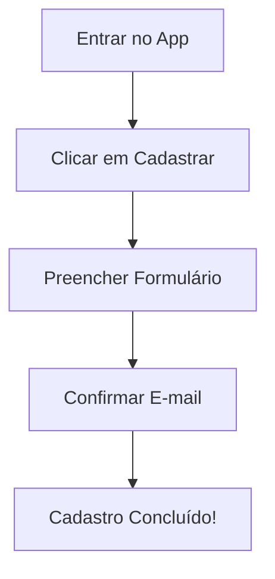
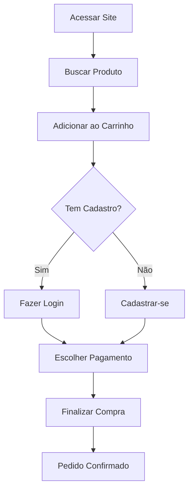

### **Tipos comuns de fluxos:**  
1. **Fluxo linear** (passo a passo simples, como um cadastro).  
2. **Fluxo ramificado** (com opções diferentes, como "esqueci minha senha").  
3. **Fluxo aberto** (o usuário pode navegar livremente, como em um site de notícias).  

---  

### **Por que são importantes?**  
- **Evitam confusão:** Identificam gargalos onde o usuário pode se perder.  
- **Otimizam a experiência:** Mostram onde simplificar processos.  
- **Guiam o design:** Ajudam a definir botões, menus e telas.  

---  

### **Como criar um fluxo?**  
1. **Defina a tarefa** (ex: "comprar um livro").  
2. **Liste os passos** do usuário.  
3. **Desenhe** (pode ser em papel, Figma, Miro, etc.).  
4. **Teste** com usuários reais para ver se faz sentido.  

---  

**Dica extra:** Fluxos não precisam ser superdetalhados no início. Comece simples e ajuste conforme a necessidade!  

___
Representações visuais em marmaid
Ótimo! Vou te mostrar **exemplos visuais simples** de fluxos de usuário em diferentes formatos, desde esquemas básicos até modelos mais detalhados.  

---

### **1. Fluxo Linear (Exemplo: Cadastro em um App)**  
Um fluxo básico de cadastro, sem ramificações:  

```
[Entrar no App] → [Clicar em "Cadastrar"] → [Preencher Formulário] → [Confirmar E-mail] → [Cadastro Concluído!]
```  
**Visualização:**  

*(Esse é o tipo mais simples, comum em telas de onboarding.)*  

---

### **2. Fluxo Ramificado (Exemplo: Compra em E-commerce)**  
Agora, um fluxo com decisões do usuário (sim/não, erros, alternativas):  


**O que esse fluxo mostra?**  
- O usuário pode tomar caminhos diferentes dependendo se já tem cadastro.  
- Se algo der errado (ex: pagamento recusado), o fluxo voltaria para a etapa anterior.  

*(Fluxos ramificados são essenciais para prever "rotas alternativas".)*  

---

### **3. Exemplo de Fluxo em Wireframe (Baixa Fidelidade)**  
Às vezes, fluxos são desenhados como **esboços de telas** conectadas:  

```
[Home] → [Tela de Busca] → [Lista de Resultados] → [Página do Produto]
          ↓                              ↑
[Menu Categorias] → [Filtros Aplicados]
```  
*(Assim, você vê não só os passos, mas também como as telas se relacionam.)*  

---

### **Ferramentas para Criar Fluxos Visuais:**  
- **Lápis e papel** (rápido para brainstorm).  
- **Figma** ou **Adobe XD** (para fluxos conectados a wireframes).  
- **Miro** ou **Whimsical** (para diagramas digitais interativos).  
- **Mermaid** (código simples, como os exemplos acima).  

---

### **Dica de Ouro:**  
Sempre comece com um **objetivo claro** (ex: "usuário deve resetar a senha") e pergunte:  
1. Qual é o **primeiro passo**?  
2. Onde ele pode **travar**?  
3. Existe um **caminho mais curto**?  

Quer que eu desenhe um fluxo específico para você praticar? Ou tem algum caso em mente? 😊