tags: #Faculdade #UX 
bibliografia: [Introdução e boas práticas em UX design](https://plataforma.bvirtual.com.br/Acervo/Publicacao/212580)

___
# Design Interativo e Fluxo de Usuário
## O que são fluxos de usuário?
Ótimo que você esteja estudando UX/UI! Vou explicar **fluxos de usuário** de maneira simples e didática.  

### **O que são fluxos de usuário?**  
Fluxos de usuário (ou *user flows*) são **mapas visuais** que mostram o caminho que um usuário percorre para realizar uma tarefa em um produto digital (app, site, sistema).  

Eles ajudam a entender:  
- **Como** o usuário navega;  
- **Onde** ele começa e termina;  
- **Quais passos** ele segue no meio do processo.  

Pense como um "roteiro" da jornada do usuário.  

---  

### **Exemplo Prático:**  
Imagine um app de delivery de comida. O fluxo do usuário para fazer um pedido seria:  

1. **Entrar no app** →  
2. **Buscar restaurante** →  
3. **Selecionar comida** →  
4. **Adicionar ao carrinho** →  
5. **Escolher pagamento** →  
6. **Confirmar pedido** →  
7. **Acompanhar entrega**.  

Cada uma dessas etapas pode ser desenhada em um fluxo, mostrando possíveis decisões (ex: "usuário cancela pedido?").  

### [[REPRESENTAÇÃO VISUAL DE FLUXOS(CLIQUE)]]
___

# **O que são Fluxos de Navegação?**  
São **mapas que definem como o usuário se move** entre as páginas/seções de um produto. Enquanto um *user flow* mostra a jornada para uma tarefa específica (ex: "comprar um produto"), o **fluxo de navegação** revela a **arquitetura geral** (ex: como o menu principal leva a diferentes áreas do site).  

**Diferença chave:**  
- **Fluxo de usuário** = foco em **tarefas**.  
- **Fluxo de navegação** = foco em **estrutura e conexões**.  

---

### **Como Criar um Fluxo de Navegação?**  
Siga estes passos:  

#### **1. Defina os Objetivos**  
- Qual é a **página principal** (home)?  
- Quais são as **seções essenciais** (ex: "Produtos", "Blog", "Contato")?  
- Que **caminhos** os usuários devem seguir prioritariamente?  

#### **2. Liste Todas as Páginas/Telas**  
Exemplo para um e-commerce:  
- Home  
- Categorias  
- Página do Produto  
- Carrinho  
- Checkout  
- Minha Conta  
- FAQ  

#### **3. Conecte as Páginas**  
Mostre **como uma página leva à outra**. Exemplo simplificado:  

```mermaid
graph TD
    A[Home] --> B[Categorias]
    B --> C[Página do Produto]
    C --> D[Carrinho]
    D --> E[Checkout]
    A --> F[Blog]
    A --> G[FAQ]
    C -->|"Usuário pode voltar?"| B
```  

#### **4. Adicione Níveis de Hierarquia**  
- **Primário:** Links no menu principal (ex: "Produtos").  
- **Secundário:** Submenus (ex: "Produtos > Calçados > Tênis").  
- **Terciário:** Links contextuais (ex: "Você também pode gostar...").

#### **5. Considere Fluxos Alternativos**  
- O que acontece se o usuário clicar em "Voltar"?  
- Como acessar o carrinho a partir de qualquer página?  
- Onde fica o link para "Suporte"?  

---

### **Exemplo Visual: Fluxo de Navegação de um Site de Notícias**  

```mermaid
graph TD
    A[Home] --> B[Notícias]
    A --> C[Esportes]
    A --> D[Entretenimento]
    B --> E[Notícia Individual]
    C --> F[Jogo ao Vivo]
    D --> G[Crítica de Filme]
    E -->|"Links Relacionados"| B
    F --> C
```  

**O que esse fluxo mostra?**  
- A **home** é o hub central.  
- Cada seção principal tem subpáginas.  
- Há **links de retorno** (ex: de uma notícia individual para a lista de notícias).  

---

### **Tipos Comuns de Estrutura de Navegação**  
1. **Hierárquica (em árvore):**  
   - Uma home com ramificações claras (ex: site de universidade).  
   - Ideal para conteúdos complexos.  

2. **Linear:**  
   - Passo a passo (ex: formulário multietapas).  

3. **Matricial:**  
   - Navegação livre (ex: Wikipedia, onde você pode seguir vários links).  

4. **Hub-and-Spoke:**  
   - Sempre volta para a home (comum em apps mobile).  

---

### **Ferramentas para Desenhar Fluxos de Navegação**  
- **Figma** ou **Adobe XD** (para wireframes interativos).  
- **Miro** ou **Whimsical** (para diagramas rápidos).  
- **FlowMapp** (especializada em arquitetura de informação).  

---

### **Checklist de Boas Práticas**  
✅ **Clareza:** O usuário sempre sabe onde está e como voltar.  
✅ **Consistência:** Menus no mesmo lugar em todas as páginas.  
✅ **Atalhos:** Links rápidos para ações frequentes (ex: "Carrinho").  
✅ **Profundidade controlada:** Evite mais de 3 níveis de menus.  

---

### **Exercício Prático**  
Tente desenhar o fluxo de navegação de um **app de banco**:  
1. Como o usuário vai da tela inicial até a transferência?  
2. Onde ficam o extrato e o suporte?  

Quer que eu critique ou ajude a melhorar seu fluxo? É só compartilhar! 😊